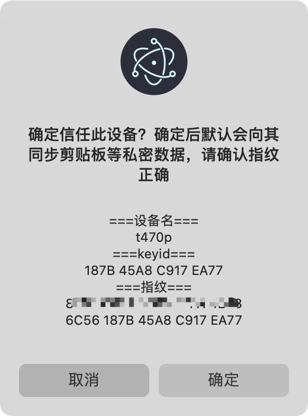
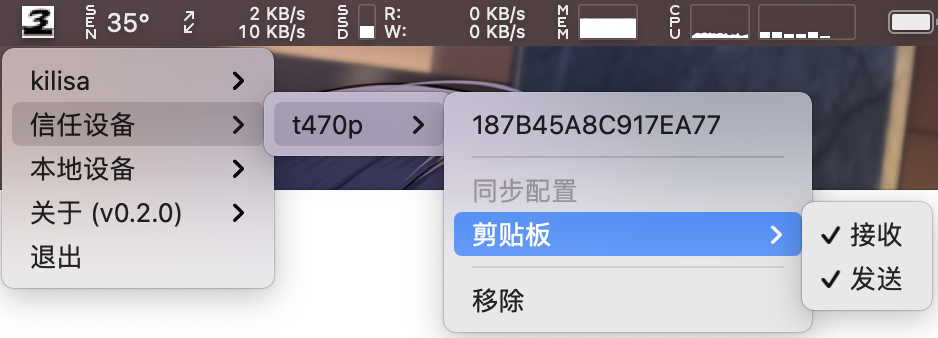
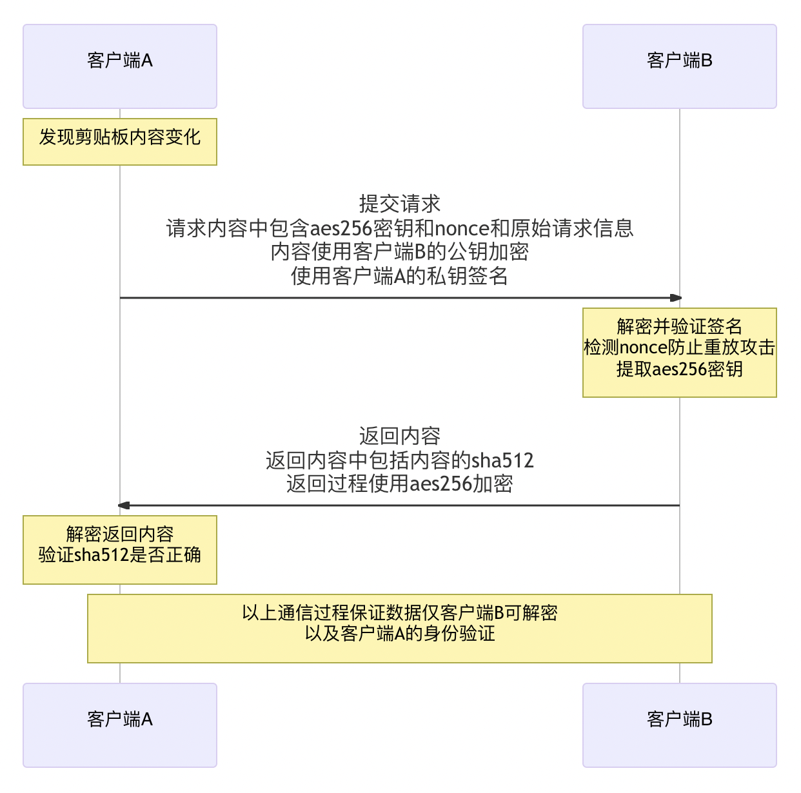

# third

## 简介

设备间剪贴板同步小工具，支持跨设备文本同步、文件复制，数据仅受信任客户端可查看。

软件自带 mdns 协议支持，内网设备自发现。跨网络设备使用 relay 中继实现。

支持 windows、linux、macos（linux 文件拷贝功能尚未完善，但是支持文件粘贴和文本同步）。

下载地址: [third release](https://github.com/Erriy/third/releases)

## 使用方法

> 注意： **需要双设备互相信任才能同步**，单方向信任的话，对端会拒绝同步数据
>
> windows/linux 粘贴文件快捷键：ctrl+shift+v
>
> macos 粘贴文件快捷键：command+shift+v
>
> **请确保快捷键未被占用**

以从 win 向 macOS 拷贝为例：

- 文字拷贝
  - win 下按 ctrl+c 进行拷贝
  - mac 下按 command+v 进行粘贴
- 文件拷贝（目前仅支持单文件拷贝，不支持文件夹和多文件）
  - win 下按 ctrl+c 进行文件拷贝
  - mac 下按 shift+command+v 进行粘贴文件（弹出保存位置对话框，确定后即开始传输）

### 添加信任的操作流程

1. 添加信任

2. 确定信任

3. 检测到剪贴板变化，会向信任设备发送同步数据

## 数据传输安全

## todo

- [ ] 开机自启动
- [ ] linux 文件拷贝支持
- [ ] 多文件（夹）拷贝（源端 zip 压缩，目的端 zip 解压缩）

> PS: [未来对此项目的规划](readme.future.md)
