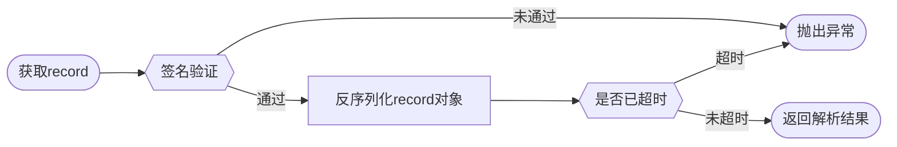
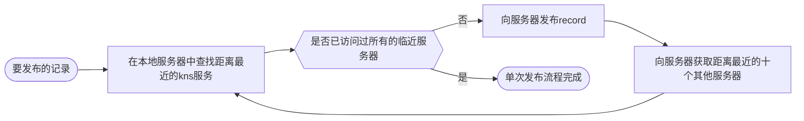
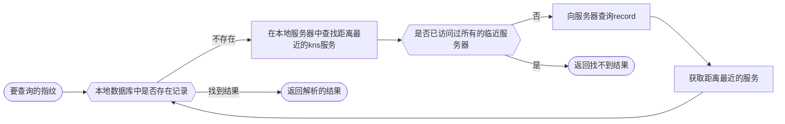
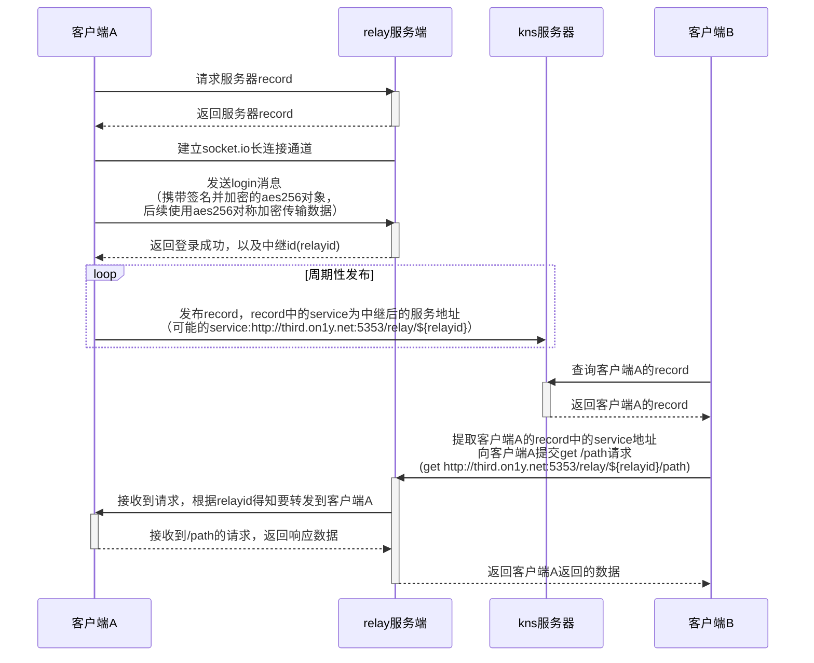
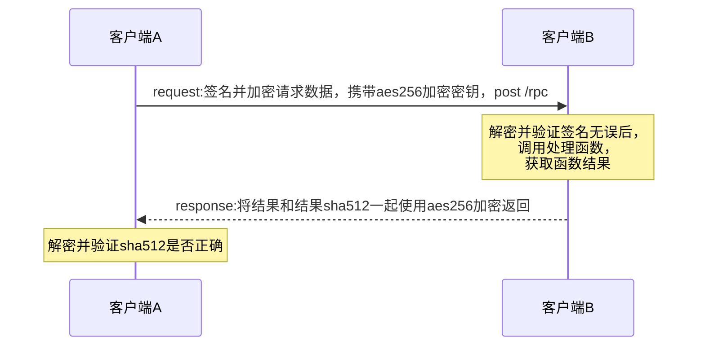
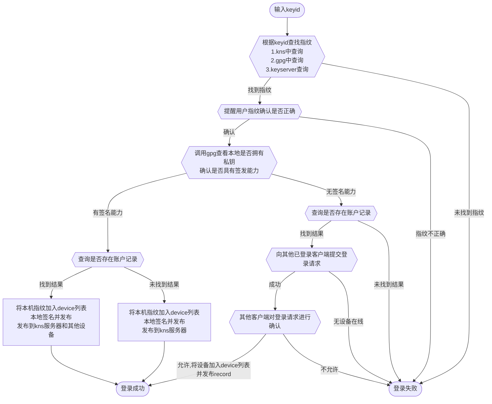
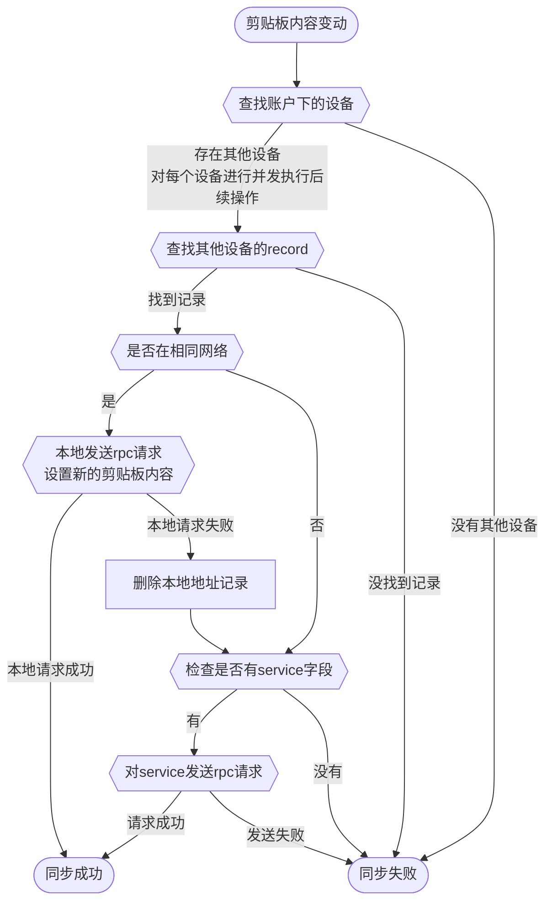

# third

基于**kns\[地址解析\]-relay\[内网穿透\]-rpc\[远程调用\]**的去中心化的类 icloud 账号通讯体系

> 我的公钥：[46C8 3280 1B39 E4EB 61DE 615E 699A 698E 7777 7777](https://keyserver.ubuntu.com/pks/lookup?op=get&search=0x46c832801b39e4eb61de615e699a698e77777777)

## 0. 相关知识

- pgp
  - gpg([阮一峰 GPG 入门教程](http://www.ruanyifeng.com/blog/2013/07/gpg.html))
  - [openpgpjs](https://github.com/openpgpjs/openpgpjs)
- [gpg smartcard](https://wiki.gnupg.org/SmartCard)
  - yubikey
    - [开启触摸保护](https://iamtwz.gitbooks.io/yubikey-handbook-chinese/content/openpgp/touch-protection/)

## 1. 使用方法

### 1.1 应用使用说明

> **请自行确保本机已安装 gpg 套件**
>
> - windows: [gpg4win](https://www.gpg4win.org/)
> - macOS: [gpg suite](https://gpgtools.org/)
> - linux：一般默认安装

- 打开[应用下载页面](https://github.com/Erriy/third/releases/latest)下载应用，安装
- 运行应用后，托盘中会出现本应用图标


- 点击登录，弹出账户登录页面

  > 注意：
  >
  > - 第一个设备登录时，本机必须有这个 gpg 的私钥，确定能签名数据。
  > - 第二个设备登录时，如果本机依然有私钥，则可以直接本机签名登录，否则会向已登录的设备发送登录请求，已登录且能使用 key 签名的设备会在菜单中显示登录请求，允许后即完成登录。

  - 登录页面：（如果本机有签名能力则直接登录成功）

  

  - 允许登录：（如果第二个登录设备没有签名能力，则有签名能力的设备允许登录后会登录成功）

  

- 确定后会调用 gpg 进行签名登录信息操作，完成后即登录完成


### 1.2 docker 启动

> 注意，只有服务器建议 docker 启动，提供 kns 和 relay 服务
>
> 剪贴板、账户系统都在 electron 部分代码中，docker 中不会启动此部分代码

- docker 直接启动服务

  ```shell
  # 因为需要获取本机真实ip，所以net指定为host模式
  docker run -d --net=host erriy/third --port 5353 --provider --enable-relay
  ```

- docker-compose 启动

  ```shell
  # 拉取预构筑镜像启动
  docker-compose up --build third-image
  # 本地构建启动
  docker-compose up --build third-build
  ```

### 1.3 代码使用说明

- 下载并安装依赖包

  ```shell
  git clone https://github.com/Erriy/third
  ```

- 安装依赖包

  ```shell
  # 在源代码根目录执行
  npm install
  ```

- 启动 ui 界面服务，页面使用 vue 编写

  ```shell
  npm run vue:serve
  ```

- 启动 electron 应用（ui 显示部分依赖 vue，建议启动完 vue:serve 后再启动）

  ```shell
  # 在windows下可能存在中文输出乱码，使用 chcp 65001 命令切换shell编码后即可正常显示中文
  npm run electron:serve
  ```

- 打包应用（打包完成后在 dist 文件夹中）

  ```shell
  npm run build
  ```

## 2. 原理

### 2.1 kns

kns（key name system）主做类 dns（domain name system）的基于 pgp 公钥指纹的地址解析模块

#### 2.1.1 record

##### 2.1.1.1 record 携带对象 object 详细格式

```jsonc
{
  // 指定record过期时间，不指定则为创建后5分钟过期，过期机制防止历史数据被恶意利用
  "expire": "...",
  // 附属子设备，可以不指定
  "device": [],
  // 服务地址，可以不指定
  "service": "http://xxxxx",
  // 是否提供kns查询和存储功能
  "provider": false
}
```

##### 2.1.1.2 record 发布格式

```jsonc
{
  // pubkey为pgp公钥数据，供验证signed部分签名是否正确
  "pubkey": "...",
  // signed为实际签名部分，对record的对象JSON序列化后的clearsign
  "signed": "..."
}
```

##### 2.1.1.3 record 解析示例



以下方 record 为例，解析过程如下：

- 使用 pubkey 验证 signed 数据签名是否正确
- 提取签名中的携带的 JSON 序列化数据，解析 expire，判断是否超时
- 解析后对象中的 service 即为对端暴露的数据接口，本例中为http://192.168.199.149:34105/

```jsonc
{
  // 公钥
  "pubkey": "-----BEGIN PGP PUBLIC KEY BLOCK-----\n\nxjMEYRY2BhYJKwYBBAHaRw8BAQdAkOqLs1eMpGDDEsXg220YLdm4ZSsLViZc\nB1vD4Wfw0kPNBXRoaXJkwowEEBYKAB0FAmEWNgYECwkHCAMVCAoEFgACAQIZ\nAQIbAwIeAQAhCRB/ULsrLsg+PxYhBBuBUCZT+khM+paIKn9QuysuyD4/VAwA\n/A2R51vmuELCaT7gZ4AAvY5czskvt7PCtysIBhtKSLN3AP9VN4Uy4pr6oofP\nl3/JwBpiHmrtZ6LxzfWs6acpUxtqCc44BGEWNgYSCisGAQQBl1UBBQEBB0C5\nZGUFsxcfZoUutRgEYIu/HuH83C8ubV3v0xFfCCJfHwMBCAfCeAQYFggACQUC\nYRY2BgIbDAAhCRB/ULsrLsg+PxYhBBuBUCZT+khM+paIKn9QuysuyD4/JV0B\nANw7XgMMf5sG9yD9EGHG6UNp6d/N0NGy7TrSUNLfG/5GAQDWNwkL+xcn14b5\nW8Z7BvWeqYimNz8Cd54Ggzjpb/bEBw==\n=uyqt\n-----END PGP PUBLIC KEY BLOCK-----\n",
  // 签名后的object对象
  "signed": "\n-----BEGIN PGP SIGNED MESSAGE-----\nHash: SHA512\n\n{\"service\":\"http://192.168.199.149:34105/\",\"expire\":1629693271.874}\n-----BEGIN PGP SIGNATURE-----\n\nwnUEARYKAAYFAmEZ/ZcAIQkQf1C7Ky7IPj8WIQQbgVAmU/pITPqWiCp/ULsr\nLsg+P8LrAPkBG747gXTJNS1LI9kQwlLLBAKT4prr5B0gExbh5/gz0QEAwgRR\nQgwzda5fudsFYogPhDMClHODhlnzabsN8he7XAk=\n=khc4\n-----END PGP SIGNATURE-----\n"
}
```

#### 2.1.2 mdns

mdns 功能主要做内网设备发现，在 mdns 功能启动的情况下，会周期性内网 query 'third.local'域名，所有开启 mdns 功能的其他终端均会响应，具体原理查看[mdns](https://en.wikipedia.org/wiki/Multicast_DNS)词条。

#### 2.1.3 dht

> _以下内容中包含的距离，使用 sqlite 中的字符串排序计算_

支持简单的 dht 网络搜寻功能，主要目的是去除对 bootstrap 初始节点的依赖，方便全网设备的互相发现。

- 发布流程（周期性发布，watchdog 机制，超时未喂狗则表示对方已下线，服务器会周期性清理 record）



- 查询流程



#### 2.1.4 工作流程

- 持续性发布设备 record 和账户 record 到 bootstrap 和 dht 网络
- 本地局域网持续性使用 mdns 发布和查询，做本地设备发现
- 提供查询方法，查询时返回 record 记录和 mdns 发现的本地服务地址

### 2.2 relay

relay 模块主做 http 请求中继功能（反向代理），类 ngrok、frp 的内网穿透模块，但是仅支持 http 协议，客户端可以嵌入到代码中使用。

以下时序图演示的是 relay 工作流程



### 2.3 rpc

基于 http 做的 rpc 调用，方便设备间访问，流程如下



### 2.4 account

账户 record 与设备 record 一致，包括 device 字段的则认定为是一个账户记录。

账户记录会调用 gpg 进行签名，本软件目前并不负责账户的创建和管理工作，

### 2.4.1 登录逻辑



### 2.4.2 以 clipboard 同步来解释 account 工作原理



## 3. 目前支持功能

- clipboard
  - 文字同步

## 4. Q&A

### 4.1 为什么不使用 pgp 的 subkey 做 device key

如果使用 subkey 做 device key 的话，subkey 丢失需要主 key revoke subkey，然后一直携带到主 key 的公钥中。随着设备的增多或 key 的变化，主 key 的公钥大小会逐渐膨胀，不是想看到的情况。sign-key 也是一样，对设备 key 进行签名则表示对 key 的信任，如果需要踢出设备的话，会需要 revoke 对设备 key 的签名，然后再发布，不如直接签发一段动态信任的数据可靠。

## 5. 碎碎念

- 其实整体逻辑跟 tor 网络有些相似的，又有些像 keybase、icloud 和 tox，本质就是怎么找到对方并可以确认信息未被嗅探和篡改。kns+relay+rpc 调用即可实现找到对方，通过远程调用沟通。
- 账户间通信设计也比较简单，将账户 record 中的 device 部分使用各个设备 key 加密，然后设置 service 字段，service 指定一个缓存服务器，所有设备都连接这个缓存服务器获取数据，就可以不用所有设备在线才能痛心了，也能隐藏账户下的设备，仅暴露一个公开接口，而这个公开接口保留的数据都是加密的，服务器的权限是最低化的。

## 6. todo

- [ ] 设备别名
- [ ] clipboard 同步加强
  - [ ] 文件跨设备拷贝
  - [ ] 截图拷贝
- [ ] 设备远程控制
- [ ] 插件体系/暴露本机接口的扩展
- [ ] 账户间通信
- [ ] 文件同步
  - [ ] 自动备份到 github、网盘、私有云、oss 等
- [ ] 支持云服务代理（可以进行收费购买，也可以自建）
  - 一个个人网关，不暴露个人设备，网关服务代理中转所有请求
  - 托管开放数据，类似博客、微博等功能，发布自己的公开数据
  - 代收私信等功能，防止暴露个人设备，防止所有设备都不在线的情况下无法收取服务，类似邮件服务器或网站站内信
- [ ] 访问权限控制
- [ ] 建立虚拟网卡，做完整的协议支持
